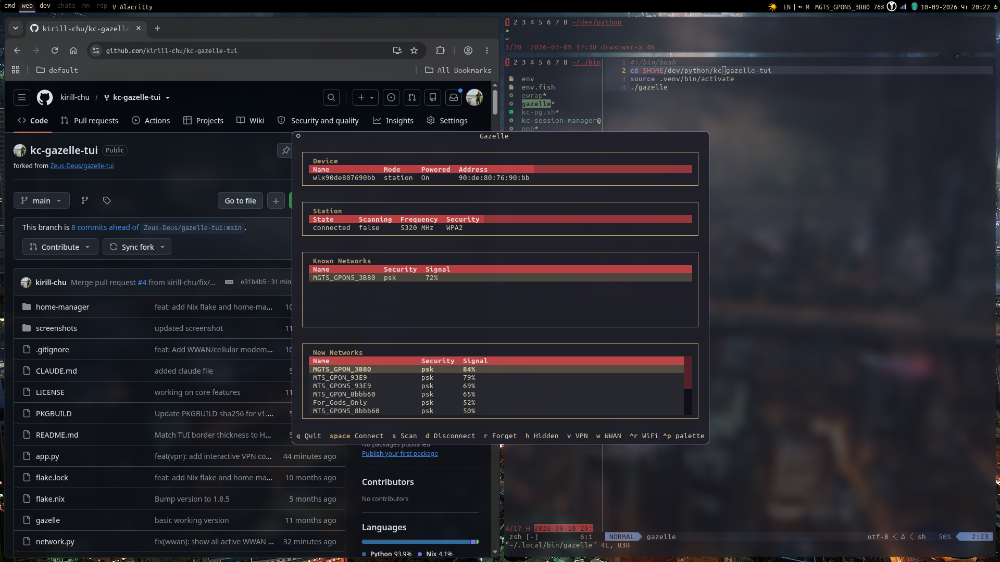

# kc-gazelle-tui

> A fork of [Zeus-Deus/gazelle-tui](https://github.com/Zeus-Deus/gazelle-tui)
> with Alacritty theme integration and interactive VPN support.



`kc-gazelle-tui` is a minimal NetworkManager TUI for Linux. It provides WiFi
scanning, connection management, VPN control, WWAN (cellular) management, and
802.1X enterprise authentication — all from the terminal, without a desktop
applet.

This fork focuses on:

- **Alacritty theme integration** — colors are read from your active Alacritty
  theme, so the TUI matches your terminal out of the box.
- **Interactive VPN connection** — connects to VPNs through `nmcli --ask` in a
  PTY, supporting GROUP selection, username, password, OTP, and
  challenge-response prompts, without requiring `nm-applet`.
- **Multiple active VPNs** — all active VPN connections are displayed, not just
  the first one.
- **Readable DataTable headers** — table headers use the active theme's colors
  instead of falling back to the terminal's ANSI palette.

---

## Original project

This project is a fork of [gazelle-tui](https://github.com/Zeus-Deus/gazelle-tui)
by [Zeus-Deus](https://github.com/Zeus-Deus). The original project provides the
core NetworkManager TUI functionality, including WiFi management, the main
interface, and the base architecture. All credit for the foundation goes to the
original author.

The fork is maintained by `kirill-chu` (GitHub: [kirill-chu](https://github.com/kirill-chu)).

## What's different in this fork

| Feature | Original | kc-gazelle-tui |
|---|---|---|
| Theme sources | Omarchy, `~/.config/gazelle/theme.toml` | + Alacritty theme |
| VPN connect | `nmcli connection up` (requires `nm-applet` for secrets) | PTY + `nmcli --ask` (interactive, no `nm-applet`) |
| Multiple active VPNs | First active only | All active |
| DataTable headers | ANSI fallback | Explicit `$primary` / `$text` |

## Requirements

- Linux with NetworkManager
- Python 3.11+ (or 3.10 with the `tomli` package installed)
- `nmcli` in `PATH`
- Optional: `mmcli` (ModemManager) for WWAN signal/operator info
- Optional: `dbus-python` for WiFi/WWAN radio toggling via D-Bus (falls back to
  `nmcli radio` if unavailable)

## Installation

```bash
git clone https://github.com/kirill-chu/kc-gazelle-tui.git
cd kc-gazelle-tui
uv venv --python=3.13
source .venv/bin/activate
uv pip install -r requirements.txt
./gazelle
```

On first run, Gazelle creates:
- ~/.config/gazelle/config.json — saved theme choice and optional settings

## Configuration
### Theme
Theme colors are resolved in this order (first match wins):
1. `~/.config/gazelle/theme.toml` (explicit user overrides)
2. `~/.config/omarchy/current/theme/alacritty.toml`
3. Alacritty theme — resolved via explicit path in config.json, import in `~/.config/alacritty/alacritty.toml` whose path contains theme, or `~/.config/alacritty/current_theme/theme.toml`
4. ANSI fallback — uses the terminal's ANSI palette
#### Optional: Alacritty theme path
To force a specific Alacritty theme, add it to `~/.config/gazelle/config.json`:
```json
{
  "alacritty_theme_path": "~/.config/alacritty/themes/themes/kanagawa_wave.toml"
}
```